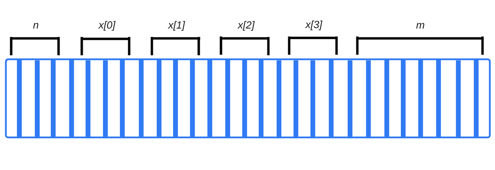
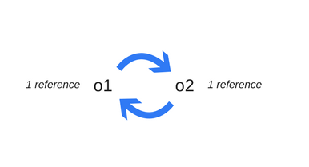
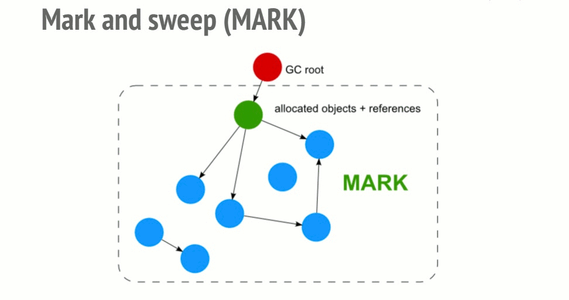
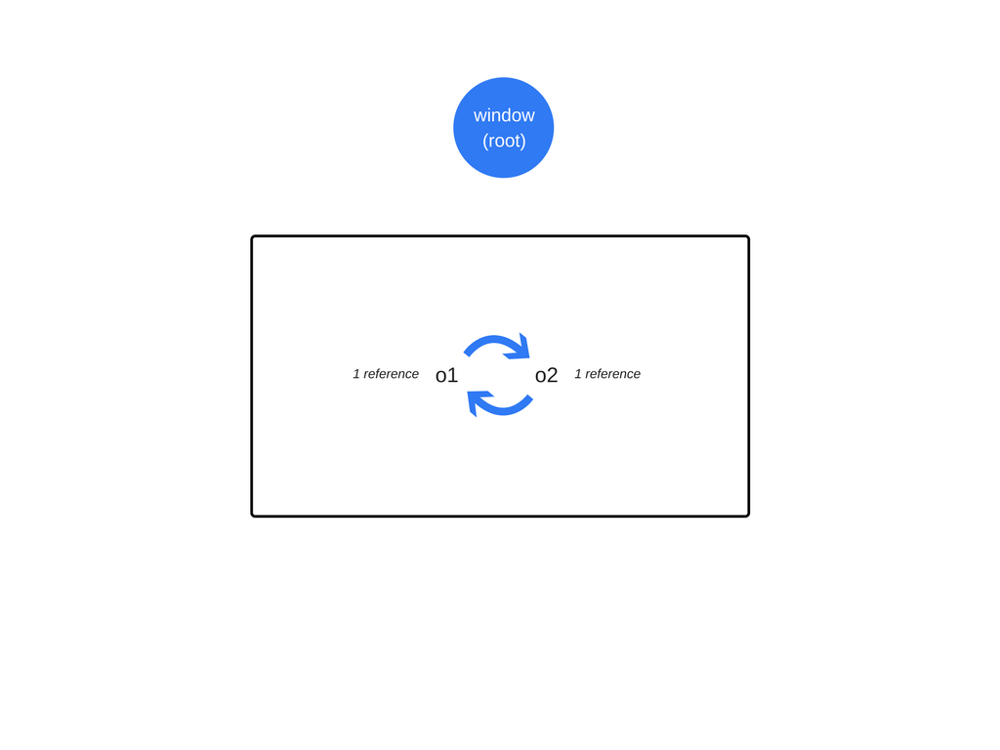

# 内存管理及如何处理 4 类常见的内存泄漏问题

> 原文请查阅[这里](https://blog.sessionstack.com/how-javascript-works-memory-management-how-to-handle-4-common-memory-leaks-3f28b94cfbec)

**这是  JavaScript 工作原理的第三章。**

我们将会讨论日常使用中另一个被开发者越来越忽略的重要话题，这都是日益成熟和复杂的编程语言的锅，即内存管理问题。我们将会提供在创建 [SessionStack](https://www.sessionstack.com/?utm_source=medium&utm_medium=blog&utm_content=Post-3-v8-intro) 的时候所遵循的处理 JavaScript 内存泄漏的几条小技巧，因为我们需要保证 SessionStack 不会引起内存泄漏或者不会增加我们所集成的 web 应用程序的内存消耗。

## 概述

像 C 语言拥有底层的内存管理原语如 `malloc()` 和 `free()`。开发者使用这些原语来显式从操作系统分配和释放内存。

与此同时，当创建事物(对象，字符串等)的时候，JavaScript 分配内存并且当它们不再使用的时候 "自动释放" 内存，这一过程称为内存垃圾回收。这个乍看起来本质上是 "自动化释放内存" 的释放资源是引起混乱的原因，并且给予 JavaScript(及其它高级语言)开发者一个错误的印象即他们可以选择忽略内存管理。**这是一个巨大的错误**。

即使是当使用高级语言的时候，开发者也应该要理解内存管理(或者至少是一些基础)。有时候自动化内存管理会存在一些问题(比如垃圾回收中的 bugs 或者实施的局限性等等)，为了能够合理地处理内存泄漏问题(或者以最小代价和代码缺陷来寻找一个合适的方案)，开发者就必须理解内存管理。

## 内存生命周期

不管你使用哪种编程语言，内存生命周期几乎是一样的：


以下是每一步生命周期所发生事情的一个概述：

* 分配内存－内存是由操作系统分配，这样你的程序就可以使用它。在底层语言(例如 C 语言)，开发者可以显式地操作内存。而在高级语言中，操作系统帮你处理。
* 使用内存－这是你的程序实际使用之前分配的内存的阶段。当你在代码中使用已分配的变量的时候，就会发生内存读写的操作。
* 内存释放－该阶段你可以释放你不再使用的整块内存，该内存就可以被释放且可以被再利用。和内存分配操作一样，该操作也是用底层语言显式编写的。

为快速浏览调用堆栈和动态内存管理的概念，你可以阅读第一篇[文章](overview.md)。

## 啥是内存？

在直接跳向 JavaScript 内存管理之前，先来简要地介绍一下内存及其工作原理。

从硬件层面看，计算机内存是由大量的 [flip flops](https://en.wikipedia.org/wiki/Flip-flop_%28electronics%29) 所组成的(这里大概查了下，即大量的二进制电路所组成的)。每个 flip flop 包含少量晶体管并能够存储一个比特位。单个的 flip flops 可以通过一个唯一标识符寻址，所以就可以读和覆写它们。因此，理论上，我们可以把整个计算机内存看成是由一个巨大的比特位数组所组成的，这样就可以进行读和写。

作为猿类，我们并不擅长用位来进行所有的逻辑思考和计算，所以我们把位组织成一个更大的组，这样就可以用来表示数字。8 位称为一字节。除了字节还有字(16 或 32 位)。

内存中存储着很多东西：

* 所有变量及所有程序使用的其它数据。
* 程序的及操作系统的代码。

编译器和操作系统一起协作来为你进行内存管理，但是建议你了解一下底层是如何实现的。

当编译你的代码的时候，编译器会检查原始数据类型并提前计算出程序运行所需要的内存大小。在所谓的静态堆栈空间中，所需的内存大小会被分配给程序。这些变量所分配到的内存所在的空间之所以被称为静态内存空间是因为当调用函数的时候，函数所需的内存会被添加到现存内存的顶部。当函数中断，它们被以 LIFO(后进先出) 的顺序移出内存。比如，考虑如下代码：

```
int n; // 4 字节
int x[4]; // 4 个元素的数组，每个数组元素 4 个字节
double m; // 8 字节
```

编译器会立即计算出代码所需的内存：4 + 4 x 4 + 8 = 28 字节。

> 编译器是这样处理当前整数和浮点数的大小的。大约 20 年前，整数一般是 2 字节而 浮点数是 4 字节。你的代码不用依赖于当前基础数据类型的字节大小。

编译器会插入标记，标记会和操作系统协商从堆栈中获取所需要的内存大小，以便在堆栈中存储你的变量。

在以上示例中，编译知道每个变量的准确内存地址。事实上，当你编写变量 `n` 的时候，会在内部把它转换为类似 "内存地址 412763" 的样子。

注意到这里当我们试图访问 `x[4]` 时候，将会访问到 m 相关的数据。这是因为我们访问了数组中不存在的数组元素－它超过了最后一个实际分配到内存的数组元素 `x[3]` 4 字节，并且有可能会读取(或者覆写) `m` 的位。这几乎可以确定会产生其它程序所预料不到的后果。



当函数调用其它函数的时候，各个函数都会在被调用的时候取得其在堆栈中的各自分片内存地址。函数会把保存它所有的本地变量，但也会有一个程序计数器用来记住函数在其执行环境中的地址。当函数运行结束时，其内存块可以再次被用作其它用途。

## 动态内存分配

不幸的是，想要知道编译时一个变量需要多少内存并没有想象中那般容易。设想一下若要做类似如下事情：

```
int n = readInput(); // 从用户读取信息
...
// 创建一个含有 n 个元素的数组
```

这里，编译器并不知道编译时数组需要多少内存，因为这是由用户输入的数组元素的值所决定的。

因此，就不能够在堆栈中为变量分配内存空间。相反，程序需要在运行时显式地从操作系统分配到正确的内存空间。这里的内存是由动态内存空间所分配的。静态和动态内存分配的差异总结如下图表：


*静态和动态分配内存的区别*

为了完全理解动态内存分配的工作原理，我们需要花点时间了解**指针**，这个就可能有点跑题了 ^.^。如果你对指针感兴趣，请留言，然后我们将会在以后的章节中讨论更多关于指针的内容。

## JavaScript 中的内存分配

现在，我们将会介绍在 JavaScript 中是如何分配内存的((第一步)。

JavaScript 通过声明变量值，自己处理内存分配工作而不需要开发者干涉。

```
var n = 374; // 为数字分配内存
var s = 'sessionstack'; // 为字符串分配内存

var o = {
  a: 1,
  b: null
}; // 为对象及其值分配内存

var a = [1, null, 'str']; // (类似对象)为数组及其数组元素值分配内存

function f(a) {
  return a + 3;
} // 分配一个函数(一个可调用对象)

// 函数表达式也分配一个对象
someElement.addEventListener('click', function() {
  someElement.style.backgroundColor = 'blue';
}, false);
```

一些函数调用也会分配一个对象：

```
var d = new Date(); // 分配一个日期对象

var e = document.createElement('div'); // 分配一个 DOM 元素
```

可以分配值或对象的方法：

```
var s1 = 'sessionstack';
var s2 = s1.substr(0, 3); // s2 为一个新字符串
// 因为字符串是不可变的，所以 JavaScript 可能会选择不分配内存而只是存储数组 [0, 3] 的内存地址范围。
var a1 = ['str1', 'str2'];
var a2 = ['str3', 'str4'];
var a3 = a1.concat(a2); 
// 包含 4 个元素的新数组由 a1 和 a2 数组元素所组成
```

## JavaScript 中的内存使用

JavaScript 中使用分配的内存主要指的是内存读写。

可以通过为变量或者对象属性赋值，亦或是为函数传参来使用内存。

## 释放不再使用的内存

大多数的内存管理问题是出现在这一阶段。

痛点在于检测出何时分配的内存是闲置的。它经常会要求开发者来决定程序中的这段内存是否已经不再使用，然后释放它。

高级程序语言集成了一块称为垃圾回收器的软件，该软件的工作就是追踪内存分配和使用情况以便找出并自动释放闲置的分配内存片段。

不幸的是，这是个近似的过程，因为判定一些内存片段是否闲置的普遍问题在于其不可判定性(不能为算法所解决)。

大多数的垃圾回收器会收集那些不再被访问的内存，比如引用该内存的所有变量超出了内存寻址范围。然而还是会有低于近似值的内存空间被收集，因为在任何情况下仍然可能会有变量在内存寻址范围内引用该内存地址，即使该内存是闲置的。

## 内存垃圾回收

由于找出 "不再使用" 的内存的不可判定性，针对这一普遍问题，垃圾回收实现了一个有限的解决方案。本小节将会阐述必要的观点来理解主要的内存垃圾回收算法及其局限性。

## 内存引用

引用是内存垃圾回收算法所依赖的主要概念之一。

在内存管理上下文中，如果对象 A 访问了另一个对象 B 表示 A 引用了对象 B(可以隐式或显式)。举个栗子，一个 JavaScript 对象有引用了它的[原型](https://developer.mozilla.org/en-US/docs/Web/JavaScript/Guide/Inheritance_and_the_prototype_chain)(隐式引用)和它的属性值(显式引用)。

在这个上下文中，"对象" 的概念被拓展超过了一般的 JavaScript 对象并且包含函数作用域(或者全局词法作用域)。

> 词法作用域定义了如何在嵌套函数中解析变量名。即使父函数已经返回，内部的函数仍然会包含父函数的作用域。

## 垃圾回收引用计数

这是最简单的内存垃圾回收算法。当一个对象被 0 引用，会被标记为 "可回收内存垃圾"。

看下如下代码：

```
var o1 = {
  o2: {
    x: 1
  }
};

// 创建两个对象。
// 'o1' 引用对象 'o2' 作为其属性。全部都是不可回收的。

// 'o3' 是第二个引用 'o1' 对象的变量
var o3 = o1; 

o1 = 1; // 现在，原先在 'o1' 中的对象只有一个单一的引用，以变量 'o3' 来表示

// 引用对象的 'o2' 属性。
// 该对象有两个引用：一个是作为属性，另一个是 'o4' 变量
var o4 = o3.o2;

// 'o1' 对象现在只有 0 引用，它可以被作为内存垃圾回收。
// 然而，其 'o2' 属性仍然被变量 'o4' 所引用，所以它的内存不能够被释放。
o3 = '374';

o4 = null;
// 'o1' 中的 'o2' 属性现在只有 0 引用了。所以 'o1' 对象可以被回收。
```

## 循环引用是个麻烦事

循环引用会造成限制。在以下的示例中，创建了两个互相引用的对象，这样就会造成循环引用。函数调用之后他们将会超出范围，所以，实际上它们是无用且可以释放对他们的引用。然而，引用计数算法会认为由于两个对象都至少互相引用一次，所以他们都不可回收的。

```
function f() {
  var o1 = {};
  var o2 = {};
  o1.P = O2; // O1 引用 o2
  o2.p = o1; // o2 引用 o1. 这就造成循环引用
}

f();
```



## 标记-清除算法

为了判断是否需要释放对对象的引用，算法会确定该对象是否可获得。

标记-清除算法包含三个步骤：

* 根：一般来说，根指的是代码中引用的全局变量。就拿 JavaScript 来说，window 对象即是根的全局变量。Node.js 中相对应的变量为 "global"。垃圾回收器会构建出一份所有根变量的完整列表。
* 随后，算法会检测所有的根变量及他们的后代变量并标记它们为激活状态(表示它们不可回收)。任何根变量所到达不了的变量(或者对象等等)都会被标记为内存垃圾。
* 最后，垃圾回收器会释放所有非激活状态的内存片段然后返还给操作系统。



*标记-清除算法的动态图示*

该算法比之前的算法要好，因为对象零引用可以让对象不可获得。反之则不然，正如之前所看到的循环引用。

从 2012 年起，所有的现代浏览器都内置了一个标记－清除垃圾回收器。前些年所有对于 JavaScript 内存垃圾收集(生成/增量/并发/并行垃圾收集)的优化都是针对标记-清除算法的，但既没有提升垃圾收集算法本身，也没有提升判定对象是否可获得的能力。

你可以查看这篇[文章 ](https://en.wikipedia.org/wiki/Tracing_garbage_collection)来了解追踪内存垃圾回收的详情及包含优化了的标记-清除算法。

## 循环引用不再让人蛋疼

在之前的第一个示例中，当函数返回，全局对象不再引用这两个对象。结果，内存垃圾回收器发现它们是不可获得的。



即使两个对象互相引用，也不能够从根变量获得他们。

## 内存垃圾回收器的反直观行为

虽然内存垃圾回收器很方便，但是它们也有其一系列的代价。其中之一便是不确定性。意思即内存垃圾回收具有不可预见性。你不能确定内存垃圾收集的确切时机。这意味着在某些情况下，程序会使用比实际需要更多的内存。在其它情况下，在特定的交互敏感的程序中，你也许需要注意那些内存垃圾收集短暂停时间。虽然不确定性意味着不能够确定什么时候可以进行内存垃圾收集，但是大多数 GC 的实现都是在内存分配期间进行内存垃圾回收的一般模式。如果没有进行内存分配，大多数的内存垃圾回收就会保持闲置状态。考虑以下情况：

* 分配一段固定大小的内存。
* 大多数的元素(或所有)被标记为不可获得(假设我们赋值我们不再需要的缓存为 null )
* 不再分配其它内存。

在该情况下，大多数的内存垃圾回收器不会再运行任何的内存垃圾回收。换句话说，即使可以对该不可获得的引用进行垃圾回收，但是内存收集器不会进行标记。虽然这不是严格意义上的内存泄漏，但是这会导致高于平常的内存使用率。

## 内存泄漏是啥？

正如内存管理所说的那样，内存泄漏即一些程序在过去时使用但处于闲置状态，却没有返回给操作系统或者可用的内存池。


编程语言喜欢多种内存管理方法。然而，某个内存片段是否被使用是一个不确定的问题。换句话说，只有开发人员清楚某个内存片段是否可以返回给操作系统。

某些编程语言会为开发者提供功能函数来解决这个问题。其它的编程语言完全依赖于开发者全权掌控哪个内存片段是可回收的。维其百科上有关于[手动](https://en.wikipedia.org/wiki/Manual_memory_management)和[自动](https://en.wikipedia.org/wiki/Garbage_collection_%28computer_science%29)内存管理的好文章。

## 四种常见的 JavaScript 内存泄漏

### 1: 全局变量

JavaScript 以一种有趣的方式来处理未声明变量：当引用一个未声明的变量，会在全局对象上创建一个新的变量。在浏览器中，全局对象是 `window`，这意味着如下代码：

```
function foo(arg) {
  bar = "some text";
}
```

等同于：

```
function foo(arg) {
  window.bar = "some text";
}
```

变量 `bar` 本意是只能在 foo 函数中被引用。但是如果你没有用 `var` 来声明变量，那么将会创建一个多余的全局变量。在上面的例子中，并不会造成大的事故。但你可以很自然地想象一个更具破坏性的场景。

你也可以使用 `this` 关键字不经意地创建一个全局变量。

```
function foo() {
  this.var1 = "potential accidental global";
}

// 调用 foo 函数自身，this 会指向全局对象(window)而不是未定义
```

> 你可以通过在 JavaScript 文件的顶部添加 `'use strict'` 来避免以上的所有问题，`'use strict'` 会切换到解析 JavaScript 的更加严格的模式，这样就可以防止创建意外的全局变量。

意外的全局变量的确是个问题，而你的代码经常会被显式定义的全局变量所污染，根据定义这些全局变量是不会被内存垃圾回收器所收集的。你需要特别注意的是使用全局变量来临时存储和处理大型的位信息。只有在必要的时候使用全局变量来存储数据，记得一旦你不再使用的时候，把它赋值为 null 或者对其再分配。

### 2：定时器及被遗忘的回调函数

因为经常在 JavaScript 中使用 `setInterval`，所以让我们以它为例。

框架中提供了观察者和接受回调的其它指令通常会确保当他们的实例不可获得的时候，所有对回调的引用都会变成不可获得。很容易找到如下代码：

```
var serverData = loadData();
setInterval(function() {
  var renderer = document.getElementById('renderer');
  if (renderer) {
    renderer.innerHTML = JSON.stringify(serverData);
  }
}, 5000); // 这将会每隔大约 5 秒钟执行一次
```

以上代码片段展示了使用定时器来引用不再需要的节点或数据的后果。

`renderer` 对象会在某些时候被替换或移除，这样就会导致由定时处理程序封装的代码变得冗余。当这种情况发生的时候，不管是定时处理程序还是它的依赖都不会被垃圾回收，这是由于需要先停止定时器(记住，定时器仍然处于激活状态)。这可以归结为保存和处理数据加载的 `serverData` 变量也不会被垃圾回收。

当使用观察者的时候，你需要确保一旦你不再需要它们的时候显式地移除它们(不再需要观察者或者对象变得不可获得)。

幸运的是，大多数现代浏览器都会替你进行处理：当被观察者对象变得不可获得时，即使你忘记移除事件监听函数，浏览器也会自动回收观察者处理程序。以前，一些老掉牙的浏览器处理不了这些情况(如老旧的 IE6)。

那么，最佳实践是当对象被废弃的时候，移除观察者处理程序。查看如下例子：

```
var element = document.getElementById('launch-button');
var counter = 0;

function onClick(event) {
  counter++;
  element.innerHTML = 'text' + counter;
}

element.addEventListener('click', onClick);

// Do stuff
element.removeEventListener('click', onClick);
element.parentNode.removeChild(element);
// 现在当元素超出范围
// 即使在不能很好处理循环引用的浏览器中也会回收元素和 onClick 事件
```

在让一个 DOM 节点不可获得之前，你不再需要调用 `removeEventListener`，因为现代浏览器支持用内存垃圾回收器来检测并适当地处理 DOM 节点的生命周期。

如果你使用 `jQuery` API(其它的库和框架也支持的 API)，你可以在废弃节点之前移除事件监听函数。jQuery 也会确保即使在老旧的浏览器之中，也不会产生内存泄漏。

## 闭包

闭包是 JavaScript 的一个重要功能：嵌套函数可以访问外部(封闭)函数的变量。鉴于 JavaScript 运行时的实现细节，以下方法可能会造成内存泄漏：

```
var theThing = null

var replaceThing = function () {
  var originalThing = theThing;
  var unused = function () {
    if (originalThing) // 引用 originalThing
      console.log("hi");
  };
  theThing = {
    longStr: new Array(1000000).join('*'),
    someMethod: function () {
      console.log("message");
    }
  };
};
setInterval(replaceThing, 1000);
```

当调用 `replaceThing` 的时候，`theThing` 对象由一个大数组和新的闭包(`someMethod`)所组成。而 `originalThing` 由 `unused` 变量创建的闭包所引用(即引用 `replaceThing` 函数之前的 `theThing` 变量)。需要记住的是当一旦为同一个父作用域中的闭包创建闭包作用域的时候，该闭包作用域是共享的。

在这样的情况下，闭包 `someMethod` 和 `unused` 共享相同的作用域。`unused` 引用了 `origintalThing`。即使 `unused` 永不使用，也可以在 `replaceThing` 的作用域外使用 `someMethod` 函数。然后由于 `someMethod` 和 `unused` 共享相同的闭包作用域，`unused` 变量引用 `originalThing` 会强迫 `unused` 保持激活状态(两个闭包共享作用域)。这会阻止内存垃圾回收。

在以上例子中，闭包 `someMethod` 和 `unused` 共享作用域，而 `unused` 引用 `origintalThing`。可以在 `replaceThing` 作用域外通过 `theThing` 使用 `someMethod`，即使 `unused` 从未被使用。事实上，由于 `someMethod` 和 `unused` 共享闭包作用域，unused 引用 `origintalThing` 要求 unused 保持激活状态。

所有的这些行为会导致内存泄漏。当你不断地运行如上代码片段，你将会发现飙升的内存使用率。当内存垃圾回收器运行的时候，这些内存使用率不会下降。这里会创建出一份闭包链表(当前情况下，其根变量是 `theThing`)，每个闭包作用域都间接引用了大数组。

该问题是由 Metor 小组发现的并且他们写了一篇很好的[文章](https://blog.meteor.com/an-interesting-kind-of-javascript-memory-leak-8b47d2e7f156)来详细描述该问题。

### 4: 源自 DOM 引用

有时候，开发者会在数据结构中存储 DOM 节点。

假设你想要快速更新几行表格内容。如果你在一个字典或者数组中保存对每个表格行的引用，这将会造成重复引用相同的  DOM 元素：一个在 DOM 树中而另一个在字典中。如果你想要释放对这些表格行的引用，你需要记得让这些引用变成不可获得。

```
var elements = {
  button: document.getElementById('button'),
  image: document.getElementById('image')
};

function doStuff() {
  elements.image.src = 'http://example.com/image_name.png';
}

function removeImage() {
    // image 元素是 body 元素的直系后代元素
    document.body.removeChild(document.getElementById('image'));
    // 这时，我们仍然在 elements 全局对象中引用了 #button 元素
    // 换句话说，按钮元素仍然在内存中且不能够被垃圾回收器收集
}
```

你还需要额外考虑的情况是引用 DOM 树中的内节点或者叶节点。如果你在代码中保存着对一个单元格的引用，这时候当你决定从 DOM 中移除表格，却仍然会保持对该单元格的引用，这就会导致大量的内存泄漏。你可以认为内存垃圾回收器将会释放除了该单元格以外的内存。而这还没完。因为单元格是表格的一个后代元素而后代元素保存着对其父节点的引用，**对一个单元格的引用会导致无法释放整个表格所占用的内存**。